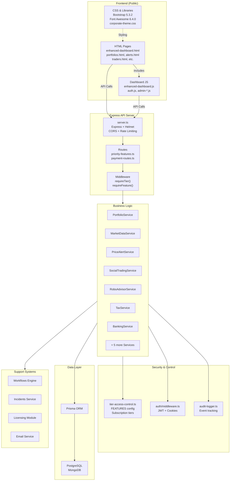

# SmartInvest Project Architecture Graph

```mermaid
graph TB
    subgraph Frontend["Frontend (Public)"]
        HTML["HTML Pages<br/>enhanced-dashboard.html<br/>portfolios.html, alerts.html<br/>traders.html, etc."]
        CSS["CSS & Libraries<br/>Bootstrap 5.3.2<br/>Font Awesome 6.4.0<br/>corporate-theme.css"]
        JS["Dashboard JS<br/>enhanced-dashboard.js<br/>auth.js, admin-*.js"]
    end

    subgraph API["Express API Server"]
        Server["server.ts<br/>Express + Helmet<br/>CORS + Rate Limiting"]
        Router["Routes<br/>priority-features.ts<br/>payment-routes.ts"]
        Middleware["Middleware<br/>requireTier()<br/>requireFeature()"]
    end

    subgraph Services["Business Logic"]
        Portfolio["PortfolioService"]
        Market["MarketDataService"]
        Alerts["PriceAlertService"]
        Social["SocialTradingService"]
        Robo["RoboAdvisorService"]
        Tax["TaxService"]
        Banking["BankingService"]
        Others["+ 5 more Services"]
    end

    subgraph Security["Security & Control"]
        TierControl["tier-access-control.ts<br/>FEATURES config<br/>Subscription tiers"]
        Auth["auth/middleware.ts<br/>JWT + Cookies"]
        Audit["audit-logger.ts<br/>Event tracking"]
    end

    subgraph Data["Data Layer"]
        Prisma["Prisma ORM"]
        DB["PostgreSQL<br/>MongoDB"]
    end

    subgraph Support["Support Systems"]
        Workflow["Workflows Engine"]
        Incidents["Incidents Service"]
        Licensing["Licensing Module"]
        Email["Email Service"]
    end

    HTML -->|API Calls| Server
    JS -->|API Calls| Server
    Server --> Router
    Router --> Middleware
    Middleware --> Services
    Services --> TierControl
    Services --> Audit
    Services --> Auth
    Services --> Prisma
    Services --> Support
    Prisma --> DB
    CSS -.->|Styling| HTML
    HTML -->|includes| JS
```